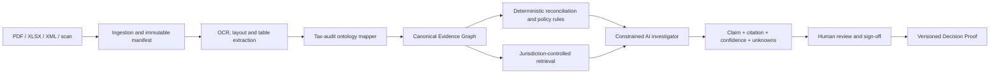

# AI Evidence Compiler برای گزارش‌های حسابرسی مالیاتی

## اصل طراحی

برای گزارش حسابرسی مالیاتی، مدل زبانی نباید «موتور حقیقت» باشد. باید در میان سه لایهٔ کنترل‌شده قرار گیرد: **استخراج ساختاریافته، کنترل و تطبیق قطعی، و توضیحِ evidence-grounded با بازبینی انسانی.** استانداردهای حرفه‌ای در حال به‌روزرسانی، به نقش فناوری، منابع اطلاعاتی رو به افزایش و professional skepticism در شواهد حسابرسی توجه دارند. [1] [2] بنابراین خروجی مطلوب FinSight نه یک خلاصهٔ روان، بلکه یک پروندهٔ تصمیم بازپخش‌پذیر است.

> هر ادعای خروجی باید یکی از سه برچسب را داشته باشد: **محاسبهٔ تأییدشده، فرضیهٔ نیازمند بازبینی، یا نامشخص**. هیچ برچسب چهارمی برای «حدس با لحن مطمئن» وجود ندارد.

## معماری پیشنهادی



| لایه | مسئولیت | مرز غیرقابل‌عبور |
|---|---|---|
| Ingestion | hash، OCR/language/layout، manifest، page/paragraph/table-cell address | منبع اصلی هرگز overwrite نمی‌شود. |
| Ontology | entity، period، tax type، jurisdiction، adjustment، assertion، evidence item | مفهوم مبهم بدون confidence و review status وارد canonical graph نمی‌شود. |
| Deterministic controls | totals، cross-foot، period consistency، ledger-to-report reconciliation، policy rule checks | مدل زبانی نمی‌تواند مقدار یا نتیجهٔ این کنترل‌ها را تغییر دهد. |
| Retrieval | بازیابی فقط از corpus مصوب و versioned هر jurisdiction | متن وب آزاد نباید مبنای tax assertion باشد. |
| AI investigator | classification، extraction proposal، anomaly explanation draft، review-question generation | AI نمی‌تواند conclusion نهایی، liability قطعی یا filing advice صادر کند. |
| Review workflow | assignment، challenge، approval، exception، sign-off | آیتم material یا blocking بدون human approval export نمی‌شود. |

## بهینه‌سازی در شش ماژول

### ۱. استخراج مبتنی بر layout و citation

OCR صرف کافی نیست. هر fact باید همراه با `source_hash`، صفحه، bbox یا table-cell، زبان، parser version و confidence نگهداری شود. برای PDFهای دیجیتال ابتدا parser متن/جدول و برای اسکن‌ها OCR اجرا شود؛ سیستم باید در سطح line item به کاربر نشان دهد عدد از کجا آمده است. اگر خوانایی یا ساختار جدول ضعیف است، نتیجه باید `needs_review` باشد، نه یک مقدار ساختگی.

```json
{
  "fact_type": "tax_adjustment",
  "value": 1250000,
  "currency": "IRR",
  "period": "1404",
  "source": {
    "document_hash": "sha256:...",
    "page": 8,
    "table": "adjustments",
    "cell": "D14"
  },
  "extraction_confidence": 0.94,
  "review_status": "needs_review"
}
```

### ۲. Tax-Audit Ontology و jurisdiction pack

یک schema واحد برای همهٔ کشورها کافی نیست. core ontology باید مفاهیم پایدار مانند `taxpayer_entity`، `assessment_period`، `audit_assertion`، `reported_amount`، `adjustment`، `supporting_evidence` و `review_outcome` را نگه دارد. هر jurisdiction pack به آن taxonomy محلی، تقویم، زبان، نسخهٔ مقررات، thresholdها و citation sourceهای approved می‌افزاید.

قانون‌ها باید versioned باشند: هر خروجی باید بگوید با کدام نسخهٔ rule pack و در چه تاریخ مؤثری بررسی شده است. این روش اجازه می‌دهد محصول ابتدا با یک حوزهٔ قضایی و یک نوع گزارشِ پرتکرار شروع شود، بدون اینکه ادعای پوشش جهانی و غیرقابل‌دفاع داشته باشد.

### ۳. کنترل قطعی پیش از GenAI

| کنترل | مثال | رفتار سیستم |
|---|---|---|
| Arithmetic integrity | جمع adjustmentها با total report نمی‌خواند. | blocker و link به locationهای اختلاف. |
| Period/entity consistency | دورهٔ گزارش با ledger یا client entity تفاوت دارد. | comparison قفل می‌شود تا reviewer تأیید کند. |
| Completeness | annex، page یا attachment referenced اما موجود نیست. | missing-evidence task ایجاد می‌شود. |
| Duplicate/conflict | دو سند یک assertion را با مقدارهای مختلف نشان می‌دهند. | conflict cluster و priority review. |
| Policy applicability | rule pack با jurisdiction یا effective date منطبق نیست. | AI retrieval و conclusion برای آن rule ممنوع می‌شود. |

### ۴. AI Investigator محدود و مبتنی بر ابزار

به‌جای یک agent آزاد، چهار ابزار کوچک و قابل‌اندازه‌گیری ساخته شود:

| ابزار | ورودی محدود | خروجی اجباری |
|---|---|---|
| Document Classifier | manifest و preview امن | نوع سند، entity، period، language، confidence |
| Claim Extractor | صفحه/بخش مشخص + ontology | JSON schema با citation و abstention |
| Reconciliation Explainer | فقط نتایج rule engine و fact graph | hypothesis رتبه‌بندی‌شده، evidence refs، missing data |
| Workpaper Drafter | claimهای تأییدشده و hypothesisهای برچسب‌خورده | متن draft با citation داخلی و TODOهای review |

هر فراخوانی مدل باید structured output schema داشته باشد و validation سمت سرور پیش از ذخیره اجرا شود. RAG باید citation را از corpus مصوب برگرداند و محصول باید provenanceِ مدل، prompt template، retrieval snapshot و rule-pack version را ثبت کند. NIST AI RMF صراحتاً مدیریت trustworthiness در طراحی، استفاده و ارزیابی AI را هدف می‌گیرد؛ این logها ابزار عملی اجرای آن هستند. [3]

### ۵. Confidence calibration و abstention

امتیاز confidence خام مدل به تنهایی قابل‌اعتماد نیست. یک calibration layer بر اساس نوع سند، کیفیت OCR، نوع field، jurisdiction و سابقهٔ reviewer correction ساخته شود. تصمیم محصول باید به این صورت باشد:

| وضعیت | شرط | اقدام |
|---|---|---|
| Auto-pass محدود | کنترل قطعی pass، citation کامل، confidence calibrated بالا، non-material | آماده برای review سریع؛ نه sign-off خودکار. |
| Review required | citation موجود اما extraction یا policy applicability نامطمئن | به reviewer تخصصی صف‌بندی می‌شود. |
| Abstain / missing evidence | سند/منبع ناقص، conflict حل‌نشده یا confidence پایین | claim تولید نمی‌شود؛ سؤال و evidence موردنیاز نمایش داده می‌شود. |
| Block | تناقض حسابداری، identity/period نامعتبر یا rule mismatch | هیچ Decision Proof نهایی تولید نمی‌شود. |

### ۶. Evaluation harness پیش از scale

بهینه‌سازی مدل بدون test set اختصاصی، بهینه‌سازی ظاهری است. هر design partner باید با قرارداد مناسب، نمونه‌های anonymized/approved را به یک gold set تبدیل کند. مجموعه باید عمداً شامل OCR ضعیف، فارسی/انگلیسی، جدول‌های شکسته، periodهای مختلف، attachmentهای گمشده و تناقض‌های واقعی باشد.

| آزمون | معیار اصلی | gate انتشار |
|---|---|---|
| Document classification | macro-F1 بر اساس نوع سند/period/entity | افت نسبت به baseline در هیچ cohort مجاز نیست. |
| Fact extraction | field-level precision/recall با location match | fieldهای material با confidence پایین auto-confirm نمی‌شوند. |
| Citation integrity | درصد claimهای دارای citation قابل‌بازشدن | هر claim exportable باید citation معتبر داشته باشد. |
| Reconciliation | recall اختلاف‌های material شناخته‌شده | rule engine نباید به خروجی مدل وابسته باشد. |
| Abstention | درصد حالت‌های نامعلوم که درست به review فرستاده شده‌اند | false certainty به‌عنوان defect بحرانی ثبت می‌شود. |
| Reviewer impact | زمان و correction rate در pilot | صرفه‌جویی بدون افت کیفیت یا افزایش override rate پذیرفته نمی‌شود. |

## Data flywheel بدون نقض اعتماد

دادهٔ خام مشتری هرگز به‌طور پیش‌فرض برای آموزش یا بهبود مشترک استفاده نشود. حلقهٔ یادگیری باید از artifactهای کم‌خطر و opt-in تشکیل شود: patternهای schema، aliasهای بدون PII، rule outcomeهای aggregated، reviewer action taxonomy و test caseهای synthetic/anonymized. هر feedback باید به `model_version` و `evaluation_set_version` متصل باشد تا تغییر عملکرد بعدی قابل توضیح باشد.

## ترتیب پیاده‌سازی

1. **Evidence Graph v1:** location-level provenance، attachment completeness و deterministic reconciliation.
2. **One jurisdiction / one report:** یک نوع گزارش مالیاتی پرتکرار با rule pack versioned.
3. **Extraction copilot:** structured JSON با citation و human review، بدون conclusion آزاد.
4. **Evaluation console:** gold set، regression suite، calibration و reviewer-feedback capture.
5. **Controlled retrieval:** corpus مصوب، citation retrieval و policy-version controls.
6. **Workpaper automation:** Decision Proof draft که تنها از fact/claimهای دارای status مناسب استفاده کند.

## منابع

[1]: https://www.iaasb.org/consultations-projects/audit-evidence "IAASB — Audit Evidence"
[2]: https://www.iaasb.org/consultations-projects/isa-500-series "IAASB — ISA 500 Series"
[3]: https://www.nist.gov/itl/ai-risk-management-framework "NIST — AI Risk Management Framework"
