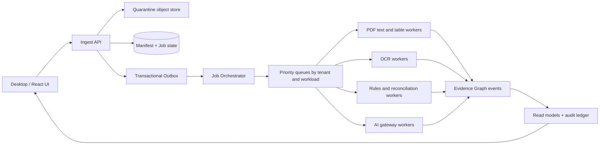

# استراتژی فنی Cloud Scaling برای موتور پردازش اسناد مالیاتی

## هدف و اصل طراحی

مقیاس‌پذیری FinSight به معنی «اضافه‌کردن server» نیست. بار اسناد مالیاتی ناهمگن است: فایل PDF کوچکِ متنی، workbook بزرگ، scan نیازمند OCR، جدول شکسته، استخراج rule-based، تحلیل AI و export هر کدام الگوی CPU، حافظه، I/O، تأخیر و حساسیت داده متفاوت دارند. معماری باید این گام‌ها را از request کاربر جدا کند، به‌صورت event-driven پردازش نماید، و در عین افزایش capacity، مرز tenant و زنجیرهٔ شواهد را حفظ کند.

> هیچ worker برای افزایش سرعت اجازه ندارد نتیجهٔ قطعی extraction را بدون citation، کنترل قطعی و وضعیت review تولید کند.

## گزینه‌های اجرا و trade-off

| رویکرد | تجربهٔ عملیاتی | Trade-off | هزینهٔ نسبی | پیچیدگی راه‌اندازی |
|---|---|---|---|---|
| **Local-first و پردازش batch محدود** | document روی دستگاه یا شبکهٔ firm پردازش می‌شود؛ cloud فقط export/metadata حداقلی دارد | کمترین exposure داده و سریع‌ترین عرضه؛ همکاری و ظرفیت مرکزی محدود است | کم | کم |
| **خدمات مدیریت‌شدهٔ event-driven با workerهای auto-scaling** | API سبک است و هر document به صف تخصصی می‌رود؛ workerها بر اساس backlog افزایش/کاهش می‌یابند | بهترین نسبت scale/عملیات برای چند tenant؛ نیازمند observability، quota و orchestration درست است | متوسط و متغیر | متوسط |
| **محیط پردازش توزیع‌شدهٔ اختصاصی** | poolهای مستقل برای OCR سنگین، پردازش حجیم و region اختصاصی وجود دارد | بیشترین ظرفیت و کنترل؛ عملیات، security و هزینهٔ بیشتری دارد | زیاد | زیاد |

مسیر local-first جایگزین سبک برای firmهای حساس یا pilot است. مسیر event-driven مدیریت‌شده برای workload معمول چندمستاجری طراحی می‌شود. محیط اختصاصی فقط وقتی لازم است که حجم، residency، ابزارهای OCR سفارشی یا resource profile از ظرفیت workerهای استاندارد فراتر رود؛ انتخاب نهایی باید با دادهٔ واقعی pilot، jurisdiction و security requirement هر firm انجام شود.

## ۱. تفکیک synchronous و asynchronous

کاربر نباید منتظر OCR، extraction یا AI در یک HTTP request بماند. API فقط authorization، file validation، manifest و ثبت job را انجام می‌دهد و سپس `202 Accepted` با `job_id` برمی‌گرداند. UI با status event/poll با فاصلهٔ کنترل‌شده، پیشرفت قابل‌فهم را نشان می‌دهد.

| گام | نوع اجرا | دلیل |
|---|---|---|
| Auth، size/type validation، malware quarantine request | synchronous و کوتاه | پاسخ سریع و policy enforcement پیش از ingest |
| Object write و manifest | synchronous و idempotent | ایجاد source-of-truth و hash پیش از پردازش |
| OCR، table extraction، text parsing | asynchronous | مصرف CPU/RAM و زمان غیرقابل‌پیش‌بینی |
| Reconciliation و policy rules | asynchronous، deterministic | قابلیت retry و parallelism بدون تغییر نتیجه |
| AI extraction/drafting | asynchronous، policy-bound | latency/provider quota و نیاز به audit context |
| Evidence Graph projection و notifications | asynchronous | decouple کردن read model از worker اصلی |
| UI status query | read-only، bounded | جلوگیری از long-lived processing session |

## ۲. معماری event-driven پیشنهادی

هر job شامل `organization_id`، `workspace_id`، `document_hash`، `revision_id`، `policy_version`، `jurisdiction_pack_version`، `idempotency_key`، `priority_class` و `data_residency` است. worker بدون این context نباید job را اجرا کند.

### Outbox و idempotency

ثبت manifest، job و outbox event باید در یک transaction منطقی انجام شود. consumer با `idempotency_key` کار کند تا retry، duplicate delivery یا restart باعث ساخت fact/approval تکراری نشود. evidence object immutable است؛ worker فقط revision جدید یا result event تولید می‌کند.

## ۳. worker poolهای resource-aware

یک autoscaler عمومی برای همهٔ documentها باعث resource starvation می‌شود. poolها باید بر اساس پروفایل workload جدا باشند.

| Worker pool | ورودی | resource profile | autoscaling signal | safety bound |
|---|---|---|---|---|
| Manifest / validation | metadata و hash | I/O کم | request rate و queue depth | rate-limit per tenant |
| Digital PDF extractor | PDF text-based | CPU متوسط، memory محدود | ready jobs و processing latency | page/size limit و timeout |
| OCR / layout | scan و جدول پیچیده | CPU/RAM بالا، گاهی accelerator | backlog age، page count، worker saturation | isolation، quota و killable job |
| Spreadsheet normalizer | XLSX/CSV | memory متغیر | file size، sheet count، queue depth | streaming/chunking و formula policy |
| Rule / reconciliation | Evidence Graph | CPU کم تا متوسط | event backlog | deterministic retry only |
| AI gateway | approved snippets | provider-bound | token/provider quota، wait time | consent، budget و concurrency cap |
| Projection / export | events و proof | I/O | lag و subscriber count | cursor/checkpoint و read replica |

Worker imageها immutable و versioned هستند. OCR/image parser، sandbox و dependencyهای سنگین در pool جدا اجرا شوند؛ API/gateway هرگز نباید parser ناشناخته را در process خود اجرا کند.

## ۴. Fairness، quota و backpressure در چندمستاجری

مقیاس‌پذیری بدون fairness باعث می‌شود یک firm با archive بزرگ، ظرفیت همهٔ firmها را مصرف کند.

| کنترل | اجرا |
|---|---|
| Weighted fair queue | هر tenant queue منطقی خود را دارد؛ scheduler بین tenantها round-robin وزنی اجرا می‌کند. |
| Concurrency quota | تعداد jobهای هم‌زمان در سطح organization، workspace و document class محدود می‌شود. |
| Token/budget quota برای AI | token و provider spend به organization و policy bound متصل است؛ exhaustion باعث review/manual path می‌شود، نه fallback پنهان. |
| Document limits | page count، bytes، archive depth و extraction time پیش از worker اعلام می‌شود. |
| Backpressure | وقتی backlog یا downstream latency از threshold عبور می‌کند، UI وضعیت «queued» نشان می‌دهد و ingest با retry-after کنترل می‌شود. |
| Priority classes | interactive review، deadline engagement و bulk backfill جدا هستند؛ bulk هرگز interactive queue را اشغال نمی‌کند. |

Noisy-neighbor signalها شامل queue age per tenant، worker CPU/memory، retry rate، object-read rate و AI provider latency هستند. این metrics باید هم در dashboard عملیاتی و هم در alert policy دیده شوند.

## ۵. Document pipeline در مقیاس

### Ingest و storage

1. فایل ابتدا در quarantine object storage ذخیره می‌شود؛ checksum، type sniffing و virus scan اجرا می‌شود.
2. بعد از pass، object immutable به evidence store منتقل و `document_hash` تولید می‌شود.
3. manifest شامل data classification، jurisdiction، retention policy و encryption context ثبت می‌شود.
4. extraction job با policy snapshot enqueue می‌شود.

### Partition و chunk

PDF در سطح document → page → region/table شکسته می‌شود، اما هر chunk parent hash و page coordinate را نگه می‌دارد. spreadsheets باید streaming خوانده شوند و به‌جای load کامل memory، sheet/row chunk پردازش شوند. chunkها خروجی نهایی نیستند؛ orchestrator فقط پس از جمع‌آوری citation و consistency check، Evidence Graph revision را publish می‌کند.

### Reconciliation fan-out/fan-in

controlهای مستقل مانند arithmetic check، attachment completeness و duplicate/conflict scan می‌توانند parallel اجرا شوند. مرحلهٔ fan-in تنها وقتی complete است که تمام control statusها و provenanceهای لازم حاضرند؛ timeout یا failure باید `needs_review` ایجاد کند، نه `pass` ضمنی.

## ۶. Data layer scaling

| لایه | راهبرد رشد | guardrail امنیت و صحت |
|---|---|---|
| Object storage | lifecycle tiering، multipart upload، regional replication policy | encryption per tenant، opaque key، immutable revision، malware status |
| PostgreSQL metadata | read replica برای query، partition زمانی/tenant-aware برای eventهای حجیم | RLS، tenant context اجباری، migration audited |
| Evidence Graph | event log append-only + materialized read models | schema version، causal parent و replay test |
| Search/index | index async برای facts/citations، shard بر اساس tenant/workspace در scale بالا | document content فقط در index policy-approved؛ ACL filter در query |
| Cache | cache metadata/read model کوتاه‌عمر | cache key شامل organization/workspace/policy version؛ raw document cache ممنوع |
| Audit ledger | append-only archive و periodic integrity verification | hash chain، write separation و export receipt |

## ۷. AI throughput بدون قربانی‌کردن governance

AI worker نباید صف استخراج را block کند. هر task ابتدا باید deterministic evidence و context محدود داشته باشد. سپس AI gateway با provider quota، region policy، model registry و budget policy تصمیم می‌گیرد.

| وضعیت | رفتار مقیاس‌پذیر |
|---|---|
| provider latency بالا | job در state قابل‌مشاهدهٔ `waiting_on_provider` می‌رود؛ UI زمان پنهان نشان نمی‌دهد. |
| quota تمام شده | task به review queue یا retry policy کنترل‌شده می‌رود؛ provider جایگزین بدون policy مجاز نیست. |
| large context | page/snippet retrieval و hierarchical summarization؛ فایل کامل default نیست. |
| model update | shadow evaluation و regression set پیش از traffic ramp؛ model/version در event ثبت می‌شود. |
| high-volume bulk | batch window با fairness؛ workflow interactive اولویت دارد. |

NIST AI RMF مدیریت trustworthiness را در design، development، use و evaluation هدف می‌گیرد. [1] در مقیاس، این به معنای model registry، evaluation gate، policy-bound routing و audit event است؛ نه صرفاً افزایش concurrency.

## ۸. Observability و SLOها

مقیاس بدون instrument شدن قابل‌کنترل نیست. هر request و event باید trace قابل‌همبستگی با `organization_id`، `workspace_id`، `document_hash` و `job_id` داشته باشد؛ متن سند یا PII نباید به trace/log عمومی وارد شود.

| حوزه | metricهای کلیدی | تصمیم عملیاتی |
|---|---|---|
| Ingest | upload success، quarantine time، rejected type/size | تشخیص UX یا abuse |
| Queue | depth، oldest-job age، retry، dead-letter | scale worker یا stop intake bulk |
| Worker | CPU، memory، page/sec، crash، timeout | resource profile و limit tuning |
| Quality | extraction empty rate، citation coverage، rule failure، abstention rate | توقف rollout یا regression investigation |
| Tenant fairness | latency/throughput per tenant، quota deny | tuning scheduler و plan boundary |
| AI | provider latency، error، token budget، review override | routing/policy refinement |
| Data | RLS deny، cross-tenant test result، restore success | security incident detection |
| Cost | compute per document class، storage lifecycle، AI per engagement | pricing/guardrail adjustment |

SLOها باید per document class تعریف شوند؛ یک PDF متنی interactive و یک scan هزارصفحه‌ای bulk نباید یک latency target یا user expectation داشته باشند. Error budget برای evidence quality باید سخت‌تر از throughput باشد: false certainty یا citation-less claim یک defect کیفیت است، نه صرفاً metric latency.

## ۹. Reliability، disaster recovery و failure isolation

- jobها idempotent و retryable هستند؛ retry دارای cap و backoff است.
- failure parser در sandbox/pool جدا می‌ماند و API را crash نمی‌کند.
- dead-letter queue همراه با reprocessing UI و دلیل failure نگهداری می‌شود.
- backup/restore برای metadata، object pointer، event ledger و key dependency به‌صورت دوره‌ای آزمایش می‌شود.
- regional outage به policy residency، RPO/RTO قراردادی و local-first offline mode پاسخ می‌دهد.
- result publish فقط پس از durable write و audit event انجام می‌شود.

## ۱۰. امنیت در زمان scale

با افزایش worker و region، attack surface نیز افزایش می‌یابد. NIST Zero Trust بر authorization صریح برای resourceها به‌جای اعتماد شبکه‌ای تأکید دارد. [2] در عمل:

1. هر worker service identity و least-privilege policy مجزا دارد.
2. job payload هرگز credential یا raw encryption key ندارد.
3. tenant context در API، queue، worker، database و object store enforce می‌شود.
4. outbound egress از OCR/AI pool allowlisted است.
5. secret rotation و short-lived credential برای autoscaled workerها اجباری است.
6. cross-tenant negative test در هر deploy و incident drill اجرا می‌شود.

## ۱۱. مراحل رشد فنی

| مرحله | قابلیت | شرط عبور |
|---|---|---|
| Stage 0 — Prototype | یک worker، local-first، manifest و extraction پایه | citation/provenance و manual recovery پایدار باشد. |
| Stage 1 — Managed queue | transactional outbox، worker poolهای جدا، job status و dead-letter | retry/idempotency و tenant quota در integration test pass شود. |
| Stage 2 — Multi-tenant scale | fair scheduler، RLS، encrypted object store، audit ledger و observability | no noisy-neighbor، cross-tenant و restore test قابل‌قبول باشد. |
| Stage 3 — High-volume / regional | workload-aware autoscaling، regional data policy، specialized OCR pool و read models | load/chaos test و security review برای cohort بزرگ pass شود. |
| Stage 4 — Enterprise | dedicated capacity option، SSO/SCIM، customer policy controls و cost allocation | procurement/security evidence و operational runbook repeatable باشد. |

## ۱۲. آزمون‌های مقیاس قبل از rollout

| آزمون | سناریو | نتیجهٔ مورد انتظار |
|---|---|---|
| Burst ingest | تعداد زیادی upload کوچک هم‌زمان از tenantهای مختلف | interactive queue حفظ شود و quota/status شفاف باشد. |
| Large-document isolation | scan یا workbook بزرگ در کنار review interactive | worker سنگین API/queue سبک را اشغال نکند. |
| Duplicate/replay | delivery چندبارهٔ یک event یا restart worker | یک revision/result درست و audit event قابل‌ردیابی. |
| Tenant boundary | token، URL، cache و queue context دستکاری‌شده | deny در همهٔ لایه‌ها و security event ثبت شود. |
| Dependency outage | object store، provider AI یا OCR worker unavailable | backoff/DLQ/manual review بدون data loss یا false pass. |
| Restore drill | بازیابی metadata/object/event از backup | evidence lineage و access policy بعد از restore صحیح باشد. |
| Cost guardrail | file/AI workload غیرعادی | budget/quota قبل از هزینهٔ کنترل‌نشده فعال شود. |

## منابع

[1]: https://www.nist.gov/itl/ai-risk-management-framework "NIST — AI Risk Management Framework"
[2]: https://www.nist.gov/publications/zero-trust-architecture "NIST — Zero Trust Architecture"
