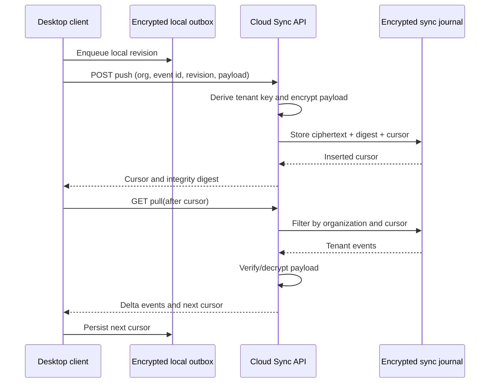

# Cloud Sync رمزنگاری‌شده و برنامهٔ Load Test برای ۵۰ شرکت حسابداری

## دامنه و تصمیم‌های طراحی

این نسخه، یک نمونه‌اولیهٔ قابل‌آزمون از **Cloud Sync مبتنی بر journal افزایشی** برای artifactهای Evidence Compiler فراهم می‌کند. هدف آن همگام‌سازی خودکار revisionهای شواهد مالیاتی میان client و سرویس cloud است؛ بدون آنکه payload مالیاتی به متن واضح در journal، log یا metadata صف تبدیل شود. این مکانیزم برای تصمیم یا filing مالیاتی طراحی نشده است و هر نتیجهٔ تحلیلی همچنان به review انسانی نیاز دارد.

> نتیجهٔ extraction یا sync بدون citation، health state و approval انسانی نباید به نتیجهٔ قطعی مالیاتی ارتقا یابد.

## ۱. اجزای پیاده‌سازی‌شده

| جزء | مسئولیت | کنترل اصلی |
|---|---|---|
| `CloudSyncService` | push idempotent و pull مبتنی بر cursor | tenant-scoped encryption، payload size cap و digest |
| `sync_events` | journal افزایشی، append-only در سطح application | constraint یکتای `organization_id + client_event_id` |
| `/api/v1/cloud-sync/push` | ثبت یک revision | tenant header، token gate production و پاسخ بدون plaintext |
| `/api/v1/cloud-sync/pull` | دریافت deltaها پس از cursor | filter اجباری tenant و limit bounded |
| `CloudSyncClient` | outbox scheduler در React/Electron | retry، pull cursor و adapter اجباری برای outbox رمزنگاری‌شده |
| Locust workload | بار synthetic از ۵۰ firm | رفتار push/pull/health و metricهای قابل‌تکرار |
| Playwright | رفتار UI Evidence Compiler | PDF cited facts، OCR block، mapping review و evidence-first navigation |

## ۲. مدل داده و جریان خودکار Sync



هر event این context را حمل می‌کند: `organization_id`، `client_event_id`، `entity_type`، `entity_id`، `revision`، `payload_digest` و `cursor`. `client_event_id` برای retryهای شبکه استفاده می‌شود و revision به conflict resolver آینده اجازه می‌دهد version policy را اعمال کند.

## ۳. رمزنگاری و جداسازی دادهٔ حساس مالیاتی

### حفاظت پیاده‌سازی‌شده

| لایه | کنترل |
|---|---|
| Encryption at rest در journal | payload با Fernet رمزنگاری authenticated می‌شود؛ ciphertext دستکاری‌شده یا قابل‌خواندن با کلید tenant دیگر نیست. |
| کلید tenant | کلید Fernet با HMAC-SHA-256 از secret سرور و `organization_id` مشتق می‌شود. |
| Integrity مستقل | SHA-256 از canonical JSON در پاسخ push/pull نگه‌داری می‌شود تا client بتواند revision را identify کند. |
| Tenant isolation | query pull همواره `organization_id` را filter می‌کند؛ test از دریافت cross-tenant جلوگیری می‌کند. |
| Replay protection | قید unique در database و lookup پیش از/پس از conflict، event تکراری را inserted جدید نمی‌کند. |
| Production gate | در حالت `FINSIGHT_ENV=production`، token تنظیم‌نشده یا نامعتبر، sync را رد می‌کند. |
| Outbox client | client به `EncryptedOutboxAdapter` وابسته است و صراحتاً نباید payload را در browser `localStorage` نگه دارد. |

Fernet رمزنگاری authenticated فراهم می‌کند؛ با این حال مدیریت lifecycle کلید بخشی از طراحی production است، نه صرفاً انتخاب library. [1] جداسازی tenant باید در همهٔ نقطه‌های resource access اعمال شود، نه فقط در API. [2]

### مرزهای نمونه‌اولیه و کارهای لازم پیش از تولید

| موضوع | وضعیت نمونه‌اولیه | الزام پیش از تولید |
|---|---|---|
| Root secret | fallback توسعه دارد | استفاده از secret manager، rotation، access audit و ممنوعیت fallback در production |
| Authentication | token محیط production | OIDC/SSO و claim امضاشدهٔ organization/workspace؛ header قابل‌جعل نباید source identity باشد |
| Key hierarchy | مشتق‌شده از root secret | envelope encryption با KMS/HSM، key version و re-encryption plan |
| Local outbox | interface موجود است | adapter Electron safe-storage/OS keychain، encryption local و recovery UX |
| Conflict resolution | event revision ثبت می‌شود | policy صریح: last-writer، review queue یا merge per entity |
| Retention/deletion | خارج از service core | policy per tenant/jurisdiction، legal hold و crypto-shredding workflow |
| Malware/content safety | خارج از sync event | quarantine قبل از object sync و link به immutable evidence object |

### گزینه‌های اجرا برای sync خودکار

| رویکرد | تجربهٔ firm | Trade-off | هزینهٔ نسبی | پیچیدگی setup |
|---|---|---|---|---|
| Local-first با export محدود | داده در دستگاه/شبکهٔ firm می‌ماند؛ sync اختیاری است | exposure کمتر، همکاری هم‌زمان محدود | کم | کم |
| Cloud Sync مدیریت‌شده با journal رمزنگاری‌شده | retry، cursor، history و همکاری بین دستگاه‌ها | نیازمند auth، monitoring، secret management و data residency | متوسط | متوسط |
| ظرفیت اختصاصی/region اختصاصی | policy و residency اختصاصی برای firm بزرگ | عملیات و هزینه بیشتر، اما isolation و کنترل قوی‌تر | زیاد | زیاد |

انتخاب production باید بعد از security review، jurisdiction mapping و اندازه‌گیری workload واقعی هر Lighthouse انجام شود. برنامه نباید برای polling پرتکرار از یک عامل انسانی یا workflow پرهزینه استفاده کند؛ sync باید با event/outbox و worker برنامه‌نویسی‌شده انجام شود.

## ۴. برنامهٔ جامع Load Test پنجاه شرکت هم‌زمان

### گاردهای اجرا

- workload فقط از مقادیر synthetic استفاده می‌کند و target آن localhost یا محیط load-test مجاز است.
- هر user یک `organization_id` مجزا از `load-firm-001` تا `load-firm-050` می‌گیرد.
- هیچ endpoint production بدون allowlist، approval مالک محیط و rate-limit اختصاصی نباید با Locust هدف قرار گیرد.
- database تست با `FINSIGHT_DATABASE_URL` از database توسعه جداست و فایل آن در `load_tests/results/` ایجاد می‌شود.

### رفتار کاربر شبیه‌سازی‌شده

| تعامل | وزن | قرارداد قابل‌بررسی |
|---|---:|---|
| Push revision شواهد | ۶ | `201` و `payload_digest` موجود باشد. |
| Pull delta با cursor | ۳ | `200`، `events` و `next_cursor` معتبر باشد. |
| Health check | ۱ | وضعیت `ok` برگردد. |

### سناریوهای scale و failure

| سناریو | تنظیم | معیار پذیرش پیشنهادی | اقدام در صورت شکست |
|---|---|---|---|
| Baseline 50 firm | ۵۰ user، ramp ۱۰ user/s، ۲۰s | خطای HTTP صفر، p95 per endpoint ثبت شود | بررسی database lock، queue و pool |
| Burst ingest | ۵۰ user، ramp سریع‌تر، push weight بالاتر | capacity limiter و 429/queued policy قابل‌مشاهده باشد | backpressure و tenant quota |
| Noisy neighbor | یک tenant با event بزرگ، ۴۹ tenant عادی | latency tenantهای دیگر به‌صورت غیرعادی رشد نکند | weighted queue و per-tenant concurrency |
| Retry/replay | همان `client_event_id` چندبار | یک cursor/revision، بدون duplicate | constraint و idempotency handler |
| Cross-tenant probe | token/cursor tenant دیگر | deny یا empty result، بدون leak | auth claim و RLS audit |
| Dependency outage | object store/KMS/provider unavailable | retry bounded و manual/review state | DLQ و circuit breaker |
| Restore drill | journal backup restore | cursor و digest قابل‌تطبیق باشد | backup/RPO policy |

### اجرای واقعی انجام‌شده

در محیط sandbox ایزوله، load harness با **۵۰ user**، ramp rate **۱۰ user در ثانیه** و مدت **۲۰ ثانیه** اجرا شد. API هدف، فقط surface Cloud Sync واقعی پروژه را با database SQLite جداگانه بالا آورد تا metricها با routerهای نامرتبط مخلوط نشوند.

| Endpoint | تعداد درخواست | خطا | میانگین | p95 | بیشینه |
|---|---:|---:|---:|---:|---:|
| `POST /cloud-sync/push` | ۷۰۶ | ۰٪ | ۵ms | ۱۶ms | ۹۷ms |
| `GET /cloud-sync/pull` | ۳۶۷ | ۰٪ | ۳ms | ۵ms | ۴۰ms |
| `GET /health` | ۱۲۲ | ۰٪ | کمتر از ۱ms | ۱ms | ۲ms |
| مجموع | ۱٬۱۹۵ | ۰٪ | ۴ms | ۷ms | ۹۷ms |

این عددها **baseline توسعه‌ای** هستند، نه ادعای capacity production. SQLite محلی، CPU sandbox، synthetic payload و مدت کوتاه هیچ‌کدام معادل workload PDF/OCR، KMS، queue distributed، اینترنت یا policyهای production نیستند.

### دستور اجرا

```bash
cd finsight-pro
sudo pip3 install -r load_tests/requirements.txt
FINSIGHT_LOAD_USERS=50 \
FINSIGHT_LOAD_SPAWN_RATE=10 \
FINSIGHT_LOAD_DURATION=20s \
./load_tests/run_local_50_firm.sh
```

خروجی‌های CSV، HTML و log در `load_tests/results/` ایجاد می‌شوند. پیش از commit، این artifacts محلی را نگه ندارید مگر آن‌که explicitly به‌عنوان evidence CI نیاز باشند.

## ۵. استراتژی scale پس از baseline

1. API sync باید stateless باقی بماند و تنها validation کوتاه، enqueue و cursor response را انجام دهد.
2. sync eventها در outbox/queue به workerهای resource-aware منتقل شوند؛ OCR، PDF extraction، reconciliation و AI نباید در همان request sync اجرا شوند.
3. scheduler باید tenant-aware باشد: quota، weighted fairness و priority class برای جلوگیری از noisy neighbor لازم است.
4. database production باید migration/unique constraint، connection pool، read model و audit ledger جدا داشته باشد؛ SQLite فقط baseline توسعه است.
5. metricهای اجباری عبارت‌اند از queue age، retry count، idempotency conflict، decrypt failure، tenant latency، budget per document و cross-tenant deny.
6. rollout از cohort کوچک Lighthouse شروع شود و در هر مرحله load/chaos test، security regression و restore drill تکرار گردد.

## ۶. پوشش E2E React

Playwright چهار رفتار حیاتی را در Chromium بررسی می‌کند: ورود Dashboard به evidence-first review، نمایش factهای PDF همراه citation، مسدودبودن PDF بدون متن تا OCR/manual review و الزام confirmation برای mapping spreadsheet. مرورگر با responseهای API fixture کار می‌کند تا test deterministic باشد و service بیرونی نخواهد.

## منابع

[1]: https://cryptography.io/en/latest/fernet/ "Cryptography — Fernet (symmetric authenticated cryptography)"
[2]: https://www.nist.gov/publications/zero-trust-architecture "NIST — Zero Trust Architecture"
