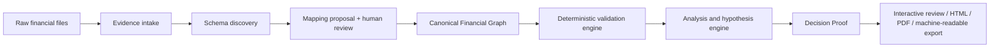

# نقشهٔ ساخت FinSight Evidence Compiler

## تصمیم معماری

FinSight Pro باید از معماری فعلیِ `file → ratios → dashboard → report` به این جریان تغییر کند:



این تغییر باید **تکاملی** باشد. موتور ratio موجود حذف نمی‌شود؛ به یک consumer قطعی از مدل کانونی جدید تبدیل می‌شود. هر calculation فعلی باید بتواند evidence inputs و metadata context خود را دریافت کند.

## مدل‌های دامنهٔ MVP

| Entity | فیلدهای کلیدی | نقش |
|---|---|---|
| `EvidenceFile` | id، hash، source_type، local_path، imported_at، locale | یک فایل یا export خام، با fingerprint برای تشخیص تغییر. |
| `EvidenceLocation` | file_id، sheet، range، row/column، raw_value | اشارهٔ دقیق به منبع هر fact. |
| `CanonicalFact` | concept_id، value، currency، scale، period، entity، source_locations | یک حقیقت مالی نرمال‌شده مانند Revenue یا Current Assets. |
| `MappingDecision` | raw_field، concept_id، confidence، rationale، status، reviewer | پیشنهاد/تأیید نگاشت با دلیل و status صریح. |
| `ValidationResult` | rule_id، severity، status، evidence_refs، remediation | نتیجهٔ یک کنترل قطعی یا business rule. |
| `AnalysisClaim` | claim، evidence_refs، assumptions، confidence_band، status | یک observation یا فرضیهٔ AI؛ هرگز fact قطعی نیست. |
| `DecisionProof` | question، scope، facts_version، claims، reviewer_signoff، export_version | بستهٔ قابل‌انتقال تصمیم و تاریخچهٔ آن. |

## چهار صفحهٔ حیاتی محصول

| صفحه | هدف طراحی | قابلیتی که باید «بی‌نقص» باشد |
|---|---|---|
| **Evidence Intake** | دریافت فایل و فهم زمینه | انتخاب entity، period، currency، scale و standard بدون فرم‌های خسته‌کننده؛ کشف هوشمند با تأیید کاربر. |
| **Mapping Review** | تبدیل دادهٔ مبهم به دادهٔ مورداعتماد | نشان‌دادن raw header، نمونهٔ مقادیر، concept پیشنهادی، confidence و امکان اصلاح با keyboard. |
| **Evidence Health** | جلوگیری از dashboard گمراه‌کننده | quality gate با خطاهای blocking، هشدارهای comparability و موارد نیازمند تأیید. |
| **Decision Proof Studio** | ساخت خروجی قابل‌دفاع | navigation از claim به formula سپس source cell؛ notation «Confirmed / Hypothesis / Unknown» و sign-off. |

## دروازهٔ کیفیت داده

محصول نباید با یک score مبهم، داده را «خوب» معرفی کند. چهار دروازه با پیام کاربردی لازم است:

| دروازه | نمونهٔ کنترل | رفتار محصول |
|---|---|---|
| **Structural** | header تکراری، شیت اشتباه، period گمشده | تحلیل متوقف و مسیر اصلاح پیشنهاد شود. |
| **Accounting integrity** | assets ≠ liabilities + equity، sign غیرمنطقی | result block شود مگر reviewer exception ثبت کند. |
| **Comparability** | هزار/میلیون نامشخص، ارز متفاوت، calendar ناسازگار | نمودار مقایسه‌ای قفل شود تا زمینه تکمیل شود. |
| **Analytical plausibility** | margin غیرعادی، revenue صفر با سود غیرصفر | هشدار evidence-level؛ هرگز auto-correct انجام نشود. |

## طراحی AI به‌صورت bounded system

### منطق قطعی اول، AI دوم

1. قواعد accounting و validation با کد قطعی اجرا می‌شوند.
2. AI فقط evidence graph و نتایج قواعد را می‌بیند؛ نه فایل خام بدون context.
3. هر پاسخ AI باید `evidence_refs`، `assumptions`، `confidence_band` و `unresolved_items` داشته باشد.
4. اگر evidence کافی نیست، schema پاسخ تنها اجازهٔ `Unknown` یا `Needs Review` می‌دهد.
5. Human approval یک state machine دارد: `draft → reviewed → approved → superseded`.

### قرارداد خروجی AI

```json
{
  "claim_type": "variance_hypothesis",
  "statement": "Operating margin declined primarily because revenue growth lagged operating expense growth.",
  "evidence_refs": ["fact:revenue:2025-Q2", "fact:operating_income:2025-Q2"],
  "assumptions": ["Period mapping is confirmed", "All figures use the same scale"],
  "confidence_band": "probable",
  "unresolved_items": ["No vendor-level expense data is available"],
  "human_review_required": true
}
```

## API و ماژول‌های ساخت اولیه

| ماژول | مسئولیت | تحویل نسخهٔ نخست |
|---|---|---|
| `evidence.ingest` | ثبت فایل، hash، sheet preview، encoding/locale detection | CSV/XLSX local import و metadata manifest. |
| `evidence.mapping` | dictionary، suggestion، review و template reuse | mapping دستی + ذخیرهٔ template روی دستگاه. |
| `evidence.validate` | قواعد structural/accounting/comparability | ۱۰ کنترل high-value با severity و remediation. |
| `financial.graph` | facts، locations، transformations و lineage queries | SQLite محلی و query «این عدد از کجا آمد؟». |
| `analysis.metrics` | ratios و trendهای موجود | انتقال ratio engine به مصرف‌کنندهٔ canonical facts. |
| `proof.compose` | question، evidence، claims و approval | HTML proof نسخه‌دار با لینک داخلی به evidence. |
| `ai.investigate` | hypothesisهای grounded در graph | ابتدا rule-assisted؛ مدل زبانی فقط برای explanation. |

## ترتیب ساختِ صحیح

### گام A — «Truth before Insight»

ابتدا `EvidenceFile`، mapping review، metadata context و validation gates را بسازید. در این گام هیچ AI آزاد، forecasting یا dashboard جدیدی اولویت ندارد. معیار موفقیت این است که کاربر بتواند علت رد یا قبول یک فایل را دقیق بفهمد.

### گام B — «Traceable analysis»

ratio و chart فعلی را به graph وصل کنید. روی هر نسبت گزینهٔ «View proof» قرار گیرد و کاربر بتواند formula و evidence locations را ببیند. هدف این گام، نمایشی کردن auditability نیست؛ باید به object model واقعی متصل باشد.

### گام C — «Decision Proof»

یک سؤال تصمیم را از کاربر بگیرید و document تعاملی بسازید. نخستین نمونه می‌تواند بررسی افت margin باشد. این خروجی باید assumptions، validation status و unresolved items را همراه insight نمایش دهد.

### گام D — «AI Investigator»

تنها پس از ایجاد graph و proof، AI را اضافه کنید. وظیفهٔ نخست: تولید explanation draft با citation داخلی و توانایی گفتن «شواهد کافی ندارم». وظیفهٔ دوم: پیشنهاد mapping با confidence و rationale. هیچ توصیهٔ سرمایه‌گذاری، حسابداری یا تصمیم خودکار تولید نشود.

### گام E — «Learning loop»

بعد از استفادهٔ واقعی، templateهای mapping و قاعده‌های validation قابل‌بازیافت بسازید. دادهٔ raw مشتری پیش‌فرض local بماند؛ برای بهبود جمعی فقط patternهای opt-in، anonymized و قابل‌بررسی وارد catalog شوند.

## آزمون‌های محصول و معیارهای خروج

| مرحله | آزمایش | معیار خروج |
|---|---|---|
| Intake | فایل‌های واقعی با headerهای انگلیسی و فارسی، چند sheet و scaleهای متفاوت | کاربر بدون کمک فنی بداند سیستم چه فهمیده و کدام بخش نیازمند تأیید است. |
| Mapping | ۱۰ template تکراری از یک advisory firm | mappingهای تأییدشده در import بعدی قابل‌بازیافت و قابل‌اصلاح باشند. |
| Validation | فایل‌های عمداً ناقص/ناسازگار | هیچ dashboard یا Decision Proof «approved» بر مبنای خطای blocking صادر نشود. |
| Proof | review توسط advisor و مدیر مشتری | هر claim در کمتر از چند interaction به شواهد اصلی برسد. |
| AI | test set با علت معلوم و علت نامعلوم | مدل در مورد نادانسته‌ها abstain کند، نه اینکه توضیح خیالی بسازد. |
| Globalization | یک جریان کامل English LTR و Persian RTL | هیچ raw string، format ثابت یا شکست layout در مسیر intake تا proof باقی نماند. |

## ساختار پیشنهادی مخزن

```text
src/finsight/
  evidence/
    ingest.py
    manifest.py
    mapping.py
    validation.py
    graph.py
    templates.py
  domain/
    facts.py
    metadata.py
    proof.py
  analysis/
    ratios.py
    trends.py
    hypotheses.py
  reports/
    proof_html.py
    proof_pdf.py
  locales/
    en.json
    fa.json
```

در لایهٔ desktop، صفحه‌های فعلی upload، dashboard و ratio table باید به `Intake → Mapping Review → Evidence Health → Proof Studio` تبدیل شوند. صفحهٔ dashboard دیگر خانهٔ اصلی محصول نیست؛ یکی از نماهای derived از Truth Graph است.

## تصمیم‌های نیازمند تأیید مالک محصول

| تصمیم | گزینهٔ پیشنهادی | چرا اکنون لازم است |
|---|---|---|
| بازار wedge | advisory/accounting firmهای چندمشتری | دادهٔ تکراری و mapping loop را سریع ایجاد می‌کند. |
| روش استقرار | local-first desktop در شروع | با حساسیت دادهٔ مالی و مزیت فعلی Electron/Python همسو است. |
| مدل تجاری | قیمت‌گذاری per analyst / per active client، نه per dashboard | با ارزش proof و workflow منطبق است. |
| integration اول | CSV/XLSX و templateهای reusable؛ سپس یک ERP منتخب | خطر scope را محدود می‌کند. |
| زبان‌های اولیه | English + Persian برای آزمون واقعی RTL؛ نه ادعای ۱۲ زبان | عیب‌های architecture را زود آشکار می‌کند. |
```
