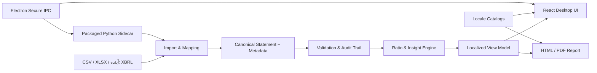

# راهبرد طراحی، توسعه و جهانی‌سازی FinSight Pro

**وضعیت سند:** پیشنهادی برای تصمیم‌گیری و آغاز اجرا  
**دامنه:** موتور متن‌باز Python، برنامهٔ دسکتاپ Electron/React/FastAPI، گزارش‌ها و صفحهٔ معرفی

## تصمیم راهبردی

FinSight Pro باید از «ماشین‌حساب نسبت‌های مالی با رابط کاربری» به **سامانهٔ محلی، قابل‌اعتماد و توضیح‌پذیر برای آماده‌سازی، اعتبارسنجی و تحلیل صورت‌های مالی** تبدیل شود. مزیت رقابتی اولیه نباید بر ادعای جایگزینی پلتفرم‌های بازار داده یا مجموعه‌ای بزرگ از قابلیت‌های تحقق‌نیافته بنا شود؛ بلکه باید بر سه ارزش قابل‌اثبات متمرکز باشد: ورود دادهٔ واقعی با اصطکاک کم، شفافیت کامل فرمول و کیفیت داده، و گزارش حرفه‌ایِ قابل‌تولید در زبان و قالب انتخابی کاربر.

این تصمیم با مسیر جهانی‌سازی سازگار است. گزارشگری دیجیتالِ ساخت‌یافته، مقایسه و تحلیل دادهٔ افشا را آسان‌تر می‌کند و XBRL برای برچسب‌های چندزبانه و اعتبارسنجی داده ظرفیت دارد. بنابراین مدل داده باید از ابتدا برای **استاندارد، ارز، مقیاس و نگاشت محلی** ساخته شود؛ نه اینکه ترجمهٔ رابط در انتهای پروژه به آن افزوده شود. [1] [2]

> **اصل محصول:** هیچ نسبت یا مقایسه‌ای بدون نشان‌دادن منبع، نگاشت ستون، مبنای گزارشگری، فرمول و محدودیت تفسیر ارائه نشود.

| سطح محصول | وعدهٔ معتبر نسخهٔ نخست | خارج از وعده تا زمان تکمیل |
|---|---|---|
| تحلیل آفلاین | ورود CSV/XLSX، نگاشت ستون، اعتبارسنجی و ۱۵ نسبت توضیح‌پذیر | تحلیل خودکار مبتنی بر دادهٔ بازار یا مشاورهٔ سرمایه‌گذاری |
| داشبورد | روندهای دوره‌ای، جدول نسبت، کیفیت داده و نمایش فرمول | بنچمارک صنعت بدون مجموعه‌داده و روش‌شناسی شفاف |
| گزارش | خروجی HTML و PDF محلی با زبان، جهت و قالب انتخابی | قالب‌های سفارشی Enterprise پیش از وجود ویرایشگر قالب |
| جهانی‌سازی | زیرساخت چندزبانه و چهارچوب محلی‌سازی آزمایش‌شده | ادعای «۱۲+ زبان» پیش از آماده‌بودن ترجمه و آزمون هر زبان |

## تجربهٔ هدف کاربر

محصول باید چهار مرحلهٔ روشن و قابل‌بازگشت داشته باشد. این جریان، شکست‌های فعلیِ ورود داده با ستون‌های دقیق و نام‌گذاری انگلیسی را حذف می‌کند و به کاربر پیش از تحلیل، اطمینان می‌دهد که داده درست فهمیده شده است.

| مرحله | مسئلهٔ کاربر | طراحی پیشنهادی | معیار پذیرش |
|---|---|---|---|
| ۱. فضای کاری | «فایل من با قالب نمونه فرق دارد.» | انتخاب فایل، انتخاب شیت، نمونهٔ قابل دانلود، ذخیرهٔ پروژهٔ محلی و انتخاب زبان | کاربر بتواند بدون ویرایش دستی نام ستون‌ها به مرحلهٔ بعد برسد. |
| ۲. نگاشت و اعتبارسنجی | «نمی‌دانم نرم‌افزار هر ستون را چه تلقی کرده است.» | جدول نگاشتِ قابل ویرایش با پیش‌نمایش داده، واحد پول، مقیاس، دوره، استاندارد و پیام خطای سطری | هیچ ستون مبهمی بدون تأیید کاربر وارد تحلیل نشود. |
| ۳. تحلیل و بینش | «نسبت چه معنایی دارد و چرا تغییر کرده است؟» | کارت‌های معیار، نمودارهای روند، جدول قابل‌فیلتر، پانل فرمول/ورودی و هشدار کیفیت داده | هر رقم به نام نسبت، فرمول و مقادیر مبنا پیوند داشته باشد. |
| ۴. گزارش و اشتراک‌گذاری | «نتیجه را باید برای مدیر یا مشتری بفرستم.» | پیش‌نمایش گزارش، زبان/جهت/قالب عددی، نام شرکت و گزینهٔ HTML یا PDF | فایل خروجی از برنامه ذخیره و در یک نمایشگر مستقل باز شود. |

## طراحی جهانی‌سازی از لایهٔ هسته

بین‌المللی‌سازی با ترجمه تفاوت دارد. W3C آن را طراحی و توسعهٔ محصول به‌گونه‌ای می‌داند که بومی‌سازی برای مخاطبانِ دارای زبان، منطقه و فرهنگ متفاوت آسان شود؛ این کار قالب عدد، تاریخ، ارز، علائم، چیدمان، جهت متن و گاهی الزامات قانونی را نیز دربر می‌گیرد. [3] FinSight Pro باید در این لایه‌ها اصلاح شود.

| لایه | وضعیت فعلی | تغییر لازم |
|---|---|---|
| واژه‌ها و متن | رشته‌های انگلیسی در React، FastAPI، نمودار Matplotlib، گزارش HTML و صفحهٔ معرفی سخت‌کد شده‌اند. | کلیدهای پیامِ معناگرا، کاتالوگ ترجمه، متن‌های قابل‌تفکیک از کد و ترجمهٔ انسانیِ بازبینی‌شده. |
| زبان و جهت | ریشه‌های HTML `lang="en"` دارند و CSS جهت‌محور است. | تگ زبان BCP 47، تنظیم `lang` و `dir` در ریشه، خواص منطقی CSS مانند `margin-inline` و آزمون RTL. W3C برای صفحات RTL استفاده از `dir="rtl"` در عنصر ریشه را توصیه می‌کند. [4] |
| قالب‌بندی | درصدها و اعداد در Python و React با قالب انگلیسی ثابت شده‌اند. | قرارداد واحد برای `Intl.NumberFormat` و قالب‌بندی سمت Python بر اساس locale؛ جداسازی نمایش از مقدار محاسباتی. |
| مدل مالی | فایل فعلی زمینهٔ ارز، مقیاس، دورهٔ مالی، چارچوب گزارشگری یا هویت شرکت ندارد. | متادیتای اجباری/اختیاری: entity، currency ISO 4217، scale، fiscal period، reporting basis، locale و source lineage. |
| ورودی | تنها ستون‌های snake_case انگلیسی پذیرفته می‌شود. | نگاشت ستون از زبان‌های محلی به مفهوم کانونی، فرهنگ واژگان قابل‌افزایش و ثبت نگاشت در پروژهٔ محلی. |
| گزارش | `lang="en"`، عناوین ثابت و جدول با جهت‌های ثابت دارد. | قالب گزارش با زبان، جهت، فونت، تاریخ، عدد و متن جایگزین محلی؛ نمودارها نیز باید رشتهٔ ترجمه‌شده دریافت کنند. |

تمام ورودی، ذخیره‌سازی و خروجی باید UTF-8 باشند و متن‌های ترجمه‌پذیر از کد جدا شوند. W3C این دو اصل و اجتناب از ساخت جمله با چسباندن قطعه‌رشته‌ها را از اصول پایهٔ نرم‌افزار بین‌المللی می‌داند. [4]

### بازارها و زبان‌های آغازین

انتخاب کشور برای فروش باید پس از مصاحبه با کاربران و بررسی امکان توزیع انجام شود؛ اما معماری نباید به این تصمیم وابسته باشد. برای آزمون واقعی زیرساخت، **English (en)** به‌عنوان زبان پایه و دست‌کم یک زبان RTL مانند **Persian (fa)** یا **Arabic (ar)** باید در خط توسعه و آزمون قرار گیرد. این انتخاب، شکست‌های چیدمان دوطرفه و قالب‌دهی را زود آشکار می‌کند، بدون آنکه وعدهٔ تجاری منطقه‌ای بدهد.

زبان‌های نمایشی باید از برچسب‌های BCP 47 استفاده کنند و کاربر در هر صفحه بتواند زبان انتخابی خود را تغییر دهد. [5] هر زبان جدید تنها زمانی در صفحهٔ معرفی اعلام شود که ترجمهٔ متن رابط، پیام‌های خطا، قالب گزارش، نمودارها، دسترس‌پذیری و آزمون تصویری آن تأیید شده باشد.

## معماری هدف

معماری پیشنهادی، حفظ موتور Python را با آماده‌سازی برای انتشار واقعاً قابل‌نصب ترکیب می‌کند. دلیل حفظ آن، ارزش فعلی Pandas/OpenPyXL/Matplotlib و فرمول‌های قابل‌آزمون است؛ اما API و قرارداد داده باید از رابط جدا شوند.

| جزء | طرح فنی پیشنهادی |
|---|---|
| دامنهٔ Python | `CanonicalStatement` و `StatementMetadata` را به‌عنوان قرارداد داده تعریف کنید. هر metric باید شناسه، کلید ترجمه، دسته، فرمول، نوع قالب و توضیح منبع داشته باشد. |
| ورود داده | `/v1/import/preview`، `/v1/import/map` و `/v1/analysis` را از هم جدا کنید. نگاشت باید توسط کاربر قابل‌تأیید و در فایل پروژهٔ محلی ذخیره شود. |
| UI دسکتاپ | React/TypeScript با یک لایهٔ i18n، state مدل‌محور و طراحی سیستم مبتنی بر token. هر کارت و جدول باید برای متن بلند و RTL واکنش‌گرا باشد. |
| بسته‌بندی | Python backend باید به‌صورت sidecar مدیریت‌شده برای هر سیستم‌عامل بسته‌بندی یا در نصب‌گر همراه شود؛ اجرای فرضی `python` روی دستگاه مشتری قابل‌اتکا نیست. |
| صادرات | گزارش HTML از مدل دادهٔ محلی بسازید؛ PDF را از همان HTML در فرآیند قابل‌آزمون تولید کنید و بایت فایل را از طریق IPC ذخیره کنید، نه مسیر موقت منقضی‌شده. |
| دادهٔ ساخت‌یافته | اتصال XBRL/iXBRL در فاز بعدی، پشت یک adapter و پس از بررسی مجوزهای taxonomy. IFRS اعلام می‌کند که استفادهٔ محصولی/خدماتی از taxonomy ممکن است مجوز بخواهد. [1] |

## امنیت و قابلیت انتشار

Electron با `contextIsolation: true` و Node integration غیرفعال، شروع خوبی دارد؛ اما برای انتشار عمومی کافی نیست. راهنمای رسمی Electron بر sandbox فرایند، CSP محدودکننده، محدودیت ناوبری و پنجرهٔ جدید، اعتبارسنجی فرستندهٔ همهٔ IPCها، عدم افشای API به محتوای غیرقابل‌اعتماد و به‌روزرسانی وابستگی‌ها تأکید دارد. [6]

| دروازهٔ انتشار | اقدام قطعی |
|---|---|
| بستهٔ قابل‌نصب | تولید نصب‌گر آزمایش‌شده روی ماشین پاک، با Python sidecar و وابستگی‌های قفل‌شده. |
| امنیت | حذف CORS فراگیر در حالت desktop، محدودسازی IPC و file-picker، CSP، sandbox و بررسی وابستگی‌ها در CI. |
| اعتماد سیستم‌عامل | امضای Windows و امضا/Notarization در macOS. Electron اعلام می‌کند هر دو سیستم‌عامل نسبت به برنامهٔ امضانشده هشدار می‌دهند. [7] |
| کیفیت | تست واحد، قراردادی API، end-to-end ورود تا گزارش، و snapshot زبان‌های LTR/RTL در CI. |
| حریم خصوصی | پردازش محلی به‌صورت پیش‌فرض؛ هر telemetry یا ارسال بازخورد فقط با رضایت روشن و سیاست حریم خصوصی همسو با بازار هدف. |

## نقشهٔ راه اولویت‌بندی‌شده

| موج | خروجی | شرط عبور |
|---|---|---|
| **P0 — تثبیت صداقت محصول** | اصلاح تست‌های شکست‌خورده؛ یکپارچه‌سازی فهرست نسبت‌ها؛ حذف یا برچسب‌گذاری صادقانهٔ قابلیت‌های برنامه‌ریزی‌شده در landing؛ API export واقعی؛ جریان نگاشت اولیه؛ مستند schema/فرمول. | تمام تست‌ها سبز باشند و هر ادعای صفحهٔ معرفی قابل‌نمایش در محصول باشد. |
| **P1 — تجربهٔ هسته** | فضای کاری، نگاشت ستون، quality panel، dashboard توضیح‌پذیر، گزارش HTML/PDF و بسته‌بندی Windows قابل‌نصب. | تحلیل نمونه تا خروجی در یک دستگاه بدون محیط توسعه تکمیل شود. |
| **P2 — i18n آمادهٔ تولید** | کاتالوگ پیام، قالب locale، زبان‌گزین، گزارش محلی، `lang/dir`، پشتیبانی آزمایش‌شدهٔ LTR/RTL. | English و یک RTL در سناریوی کامل import→report بدون نقص متن/جهت اجرا شوند. |
| **P3 — عرضهٔ بین‌المللی کنترل‌شده** | امضا و به‌روزرسانی امن؛ نصاب Windows و macOS؛ لندینگ محلی؛ فرایند پشتیبانی و بازخورد بازار. | آزمایش کاربری در بازارهای منتخب و تأیید توزیع، حریم خصوصی و پشتیبانی. |
| **P4 — داده و تمایز پیشرفته** | adapterهای XBRL/iXBRL، importهای تخصصی، project templates، بنچمارک فقط با dataset و روش‌شناسی شفاف. | قرارداد داده و الزامات مجوز/کیفیت هر منبع تأیید شوند. |

## مواردی که باید پیش از شروع توسعهٔ کامل تأیید شوند

برای جلوگیری از ساخت محصولی خارج از بازار هدف، مالک پروژه باید بازار نخست، نوع مشتری اصلی، مدل درآمد، سطح پردازش دادهٔ ابری/محلی و سیاست ترجمه را تعیین کند. همچنین چون هیچ پوشه‌ای به محیط توسعهٔ دسکتاپ این کار متصل نشده است، برای اعمال و آزمون مستقیم تغییرات روی دستگاه کاربر باید یک پوشهٔ محلی متصل شود؛ در غیر این صورت تغییرات به‌صورت patch و commit پیشنهادی در فضای کاری مخزن آماده می‌شوند.

## منابع

[1]: https://www.ifrs.org/digital-financial-reporting/ "IFRS Foundation — Digital financial reporting"
[2]: https://www.xbrl.org/the-standard/what/what-is-xbrl/ "XBRL International — What is XBRL?"
[3]: https://www.w3.org/International/questions/qa-i18n "W3C — Localization vs. Internationalization"
[4]: https://www.w3.org/International/quicktips/ "W3C — Internationalization Quick Tips for the Web"
[5]: https://www.w3.org/TR/international-specs/ "W3C — Internationalization Best Practices for Spec Developers"
[6]: https://www.electronjs.org/docs/latest/tutorial/security "Electron — Security"
[7]: https://www.electronjs.org/docs/latest/tutorial/code-signing "Electron — Code Signing"
