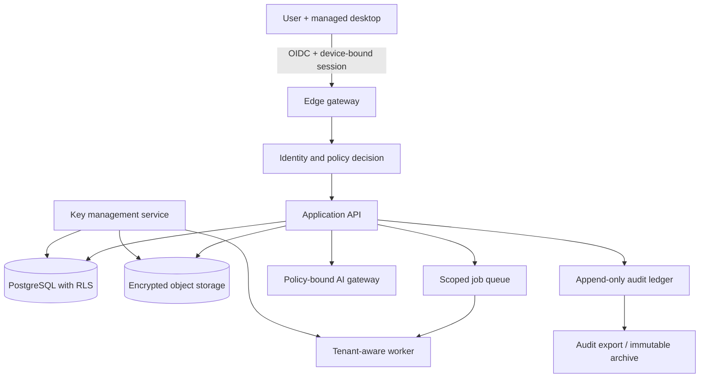

# معماری امنیتی کامل: محیط ابری چندمستاجری مدیریت‌شده

**دامنه:** FinSight Evidence Cloud Sync برای شرکت‌های حسابداری و حسابرسی مالیاتی  
**وضعیت:** مشخصات معماری برای نسخهٔ ۲؛ نه تأییدیهٔ compliance یا جایگزین ارزیابی حقوقی/امنیتی مستقل

## ۱. تصمیم معماری

گزینهٔ دوم یک سرویس مدیریت‌شدهٔ چندمستاجری است که به هر شرکت حسابداری یک سازمان مستقل، workspaceهای محدودشده، کلیدهای رمزنگاری و سیاست‌های دسترسی جداگانه می‌دهد. نسخهٔ دسکتاپ همچنان محل اصلی ingest و review است؛ cloud صرفاً برای همگام‌سازی، همکاری، backup، audit export و اجرای کنترل‌شدهٔ قابلیت‌های AI استفاده می‌شود.

> مرز امنیتی واقعی فقط `tenant_id` در یک جدول نیست. مرز شامل هویت، policy، query، cache، queue، object storage، key، log، export، backup و مسیر AI است.

NIST Zero Trust تصریح می‌کند اعتماد ضمنی بر پایهٔ موقعیت شبکه یا مالکیت asset پذیرفته نیست و authentication/authorization باید پیش از ایجاد session برای resource انجام شود. [1] این اصل به‌صورت «هر درخواست، هر شیء و هر device باید صریحاً authorize شود» در طراحی حاضر اعمال می‌شود.

## ۲. دارایی‌ها و مدل تهدید

| دارایی | حساسیت | تهدید اصلی | کنترل پایه |
|---|---|---|---|
| فایل PDF/XLSX/CSV مشتری | بسیار بالا | افشای cross-tenant، سرقت device، دسترسی provider | رمزنگاری per tenant، access policy، revision immutability |
| Evidence Graph و factها | بسیار بالا | تغییر خاموش، حذف، replay نادرست | event log append-only، hash، audit replay، approval state |
| Tax rule pack و citation corpus | بالا | نسخهٔ اشتباه، policy manipulation | signed/versioned package، owner، effective date، release gate |
| کلیدها و tokenها | بحرانی | credential theft، privilege escalation | KMS/HSM، envelope encryption، rotation، short-lived token |
| درخواست AI | بسیار بالا | ارسال بدون consent، provider retention، prompt injection | policy gateway، allowlist، redaction، task log، no-training default |
| audit log | بالا | tampering، incomplete evidence | hash chain، write-once retention، independent export |
| metadata سازمان | بالا | enumeration، cross-tenant access | row-level security، opaque IDs، authorization at every layer |

### threat scenarios اولویت‌دار

1. کاربر یک firm با URL یا ID دستکاری‌شده تلاش می‌کند evidence firm دیگر را مشاهده کند.
2. token یک reviewer از دستگاه غیرمجاز سرقت می‌شود.
3. یک sync event قدیمی یا تکراری برای بازنویسی approval جدید ارسال می‌شود.
4. background worker یا cache بدون tenant context داده را پردازش می‌کند.
5. کاربر محتویات مشتری را ناخواسته به provider مدل عمومی ارسال می‌کند.
6. process deletion، object active را حذف می‌کند اما backup/replica را نادیده می‌گیرد.
7. rule pack تغییر می‌کند و خروجی قدیمی بدون اطلاع با قانون جدید نمایش داده می‌شود.
8. provider/cloud یا credential service دچار رخداد امنیتی می‌شود.

## ۳. تفکیک trust zoneها



| zone | چه چیزی اجازه دارد؟ | چه چیزی ممنوع است؟ |
|---|---|---|
| Desktop | ingest محلی، local store، امضای event، مشاهدهٔ evidence | دسترسی مستقیم به cloud database یا key store |
| Edge/API | authentication، authorization، validation، rate limit | تصمیم tenancy فقط از header سمت client |
| Data plane | ذخیرهٔ tenant-scoped دادهٔ encrypted | query بدون `organization_id` و policy context |
| Worker/queue | jobهایی که tenant/policy/version دارند | payload مشترک، job فاقد actor/context یا global cache خام |
| AI gateway | taskهای allowlisted با policy/consent | ارسال فایل کامل یا استفادهٔ آموزشی پیش‌فرض |
| Audit plane | write append-only و export | تغییر/حذف log توسط administrator عملیاتی |

## ۴. Identity، authorization و device trust

### Identity model

```text
Organization → Workspace → Engagement → Evidence Object → Revision / Fact / Approval
             ↘ Member → Role → Permission → Policy decision
```

| نقش | حداقل دسترسی پیشنهادی |
|---|---|
| Organization owner | billing، identity policy، retention، export approval؛ بدون bypass audit log |
| Security admin | identity/provider/policy configuration؛ دسترسی محتوا فقط با break-glass workflow |
| Engagement manager | workspace/assignment، reviewer approval، export request |
| Reviewer | مشاهده evidence مجاز، annotation، approval در scope خود |
| Preparer | upload، mapping draft و issue resolution؛ بدون final sign-off |
| Read-only client | صرفاً Decision Proof export یا workspaceهای explicitly shared |
| Support | metadata حداقلی و time-bound support session؛ content access فقط با consent و audit event |

### اجرای فنی

- OIDC/OAuth 2.1 با authorization-code و PKCE برای دسکتاپ.
- tokenهای کوتاه‌عمر؛ refresh token قابل‌لغو، device-bound و rotation در هر استفاده.
- SSO/SAML و SCIM در سطح enterprise؛ MFA قابل‌اجبار بر اساس organization policy.
- policy enforcement در API و data layer؛ frontend هرگز مرجع authorization نیست.
- تمام queryهای سرویس باید context غیرقابل‌اعتماد `organization_id` را از token/policy server بگیرند، نه از form field یا path تنها.
- break-glass فقط با دلیل، approval دوم، زمان انقضا و audit export خودکار.

## ۵. tenancy و data isolation

### Database

هر جدول business-critical باید `organization_id`، `workspace_id`، `created_by`، `created_at` و `schema_version` داشته باشد. PostgreSQL Row-Level Security با roleهای حداقل‌دسترسی در سطح database اعمال شود. service role از query بدون tenant predicate منع شود؛ migration و admin reporting مسیر جدا و audited دارد.

```sql
ALTER TABLE evidence_objects ENABLE ROW LEVEL SECURITY;
CREATE POLICY organization_boundary ON evidence_objects
USING (organization_id = current_setting('app.organization_id')::uuid);
```

RLS به‌تنهایی کافی نیست. کد API باید policy decision را پیش از query اجرا کند، cache key باید `organization_id` داشته باشد، queue payload باید tenant-scoped باشد، و تست‌های cross-tenant باید جزء CI باشند.

### Object storage

- prefixهای opaque و tenant-scoped؛ نه نام فایل مشتری یا شناسهٔ قابل‌حدس در URL.
- pre-signed URL کوتاه‌عمر و single-purpose برای upload/download.
- bucket policy که تنها service identity و context tenant مجاز را بپذیرد.
- content hash برای integrity و revision tracking؛ deduplication بین tenantها ممنوع مگر با طراحی رمزنگاری جداگانه و consent صریح.
- scan بدافزار و file-type validation پیش از availability؛ فایل اولیه در quarantine قرار گیرد.

### Cache و queue

هر key شامل `organization_id`، `workspace_id` و data-classification باشد. consumer job اگر actor، organization، policy version یا idempotency key ندارد باید آن را reject کند. هیچ worker نباید از shared memory برای نگهداری متن خام مشتری استفاده کند.

## ۶. رمزنگاری و key management

| حالت داده | کنترل |
|---|---|
| In transit | TLS 1.3، HSTS، certificate rotation؛ mTLS بین سرویس‌های حساس داخلی |
| At rest: object | envelope encryption، DEK per tenant/object class، wrapping key در KMS/HSM |
| At rest: database | encryption provider + application-level encryption برای فیلدهای حساس مانند PII، token و annotation حساس |
| Local desktop | database/store رمزنگاری‌شده، key در keychain سیستم‌عامل، policy برای device loss و remote revoke |
| Backup | backup جداگانه، encrypted با key/material مستقل، restore audit و retention policy |
| Export | encryption اختیاری/اجباری بر حسب policy organization، watermark و expiry برای linkهای shared |

### lifecycle کلید

1. tenant هنگام ایجاد organization به یک key hierarchy اختصاص می‌یابد.
2. data encryption key برای object/revision یا data class تولید می‌شود.
3. KMS کلید را wrap می‌کند؛ application فقط DEK کوتاه‌عمر را در memory نگه می‌دارد.
4. rotation زمان‌بندی‌شده و rotation رخدادمحور پس از incident انجام می‌شود.
5. offboarding و deletion از crypto-erasure همراه با کنترل retention/hold پیروی می‌کند.

کلیدها هرگز در source code، log، analytics یا queue payload ذخیره نمی‌شوند. دسترسی KMS به service identity و tenant context محدود و audited است.

## ۷. پروتکل Cloud Sync

### event contract

```json
{
  "event_id": "uuid",
  "organization_id": "uuid",
  "workspace_id": "uuid",
  "actor_id": "uuid",
  "device_id": "uuid",
  "event_type": "fact.reviewed",
  "causal_parent_ids": ["uuid"],
  "schema_version": "2.1",
  "policy_version": "2026-01",
  "idempotency_key": "uuid",
  "payload_ciphertext": "...",
  "content_hash": "sha256:...",
  "device_signature": "..."
}
```

### قواعد sync

- desktop event را ابتدا در outbox پایدار محلی ثبت می‌کند؛ سپس به gateway ارسال می‌کند.
- gateway signature، user/device status، policy، schema، idempotency و causal parent را validate می‌کند.
- server acknowledgement فقط پس از commit به event ledger و data plane برگردانده می‌شود.
- retry exponential backoff دارد؛ duplicate event بدون side effect پاسخ success/idempotent می‌گیرد.
- conflictهای evidence/fact/mapping به last-write-wins حل نمی‌شوند؛ به revision یا `needs_review` تبدیل می‌شوند.
- approval و sign-off immutable هستند؛ لغو به event جدید با reason code تبدیل می‌شود.
- client در offline mode فقط context مجاز را می‌بیند و بعد از policy change باید token/policy را refresh کند.

## ۸. AI gateway و data-use policy

مدل AI خارج از trust boundary evidence نیست؛ یک processor کنترل‌شده است.

| کنترل | اجرا |
|---|---|
| Consent | organization policy و task-level notice پیش از ارسال content |
| Data minimization | فقط snippet/page/fact لازم، نه پروندهٔ کامل مگر policy اجازه دهد |
| Provider routing | allowlist provider/model/region؛ default deny برای provider جدید |
| No training default | قرارداد و runtime policy باید استفاده برای آموزش provider را پیش‌فرض ممنوع کند |
| Redaction | PII/identifier detection و redaction configurable پیش از request |
| Prompt injection | document text به‌عنوان data علامت‌گذاری می‌شود؛ دستورهای داخل document authority ندارند |
| Reproducibility | model/version/template/retrieval snapshot/policy/output hash ذخیره می‌شود |
| Export gate | AI claim بدون evidence ref یا status مناسب وارد Decision Proof نهایی نمی‌شود |

NIST AI RMF برای مدیریت trustworthiness در طراحی، توسعه، استفاده و ارزیابی AI تدوین شده است. [2] FinSight باید این را به model registry، evaluation gate، provider control، incident response و review workflow تبدیل کند.

## ۹. Audit ledger و evidence replay

هر رویداد مهم شامل upload، extraction، mapping change، policy evaluation، AI request، reviewer annotation، approval، export، download، delete request و admin access باید ثبت شود. برای جلوگیری از دستکاری پنهان، eventها در یک ledger append-only با hash chain و export قابل‌تأیید ذخیره شوند.

| قابلیت | هدف |
|---|---|
| hash chain | کشف تغییر/حذف در توالی eventها |
| policy snapshot | پاسخ به اینکه «آن زمان چه کسی مجاز بود؟» |
| evidence snapshot | پاسخ به اینکه «claim با چه فایل/نسخه‌ای ساخته شد؟» |
| AI snapshot | پاسخ به اینکه «کدام مدل/منبع این draft را ایجاد کرد؟» |
| reviewer decision | پاسخ به اینکه «چه کسی چه زمانی approve/reject کرد؟» |
| export receipt | پاسخ به اینکه «کدام proof برای چه کسی صادر شد؟» |

## ۱۰. Data lifecycle، retention و deletion

- policy در سطح organization و jurisdiction تعریف می‌شود؛ default واحد برای همه firmها کافی نیست.
- active data، archived data، backup و legal hold lifecycle مستقل اما قابل‌ردیابی دارند.
- delete request ابتدا eligibility را با retention/hold بررسی می‌کند؛ سپس object، metadata، index، cache، queue و backup schedule را در یک deletion record ثبت می‌کند.
- deletion receipt نشان می‌دهد چه چیزی حذف، چه چیزی به‌دلیل retention نگه‌داری و چه چیزی برای purge زمان‌بندی شده است.
- telemetry فقط metadata حداقلی دارد و محتوای سند، PII و prompt خام را لاگ نمی‌کند.

## ۱۱. عملیات امنیتی و reliability

| حوزه | کنترل عملیاتی |
|---|---|
| SDLC | code review، SAST، dependency/secret scanning، IaC scan و threat-model update برای changeهای حساس |
| Runtime | WAF/rate limit، DDoS protection، network segmentation، service identity، runtime detection |
| Secrets | secret manager، short-lived credential، rotation و prohibition در CI log |
| Monitoring | security events، cross-tenant deny، abnormal export، failed auth، queue anomaly، KMS anomaly |
| Incident response | severity matrix، owner، communication template، evidence preservation و tabletop exercise |
| Availability | multi-zone database/object storage، backup/restore test، outbox retry، idempotent worker |
| Disaster recovery | RPO/RTO توافق‌شده per plan، restore drill و documented failover |

## ۱۲. Security acceptance gates پیش از فروش Cloud Sync

| gate | شواهد لازم |
|---|---|
| Tenant isolation | automated negative tests در API/RLS/object/cache/queue و independent review sample |
| Authentication | MFA/SSO policy test، revoked device/token test و break-glass audit test |
| Cryptography | key inventory، rotation drill، failed-decrypt handling و backup key separation |
| Sync integrity | duplicate/replay/out-of-order/conflict/offline recovery test |
| AI controls | provider deny test، consent log، redaction regression و citation/export gate |
| Data lifecycle | retention/hold/delete/backup restore test با receipt قابل‌ممیزی |
| Incident readiness | tabletop برای device compromise، cross-tenant attempt و provider exposure |
| External assurance readiness | control inventory و evidence pack برای security questionnaire مشتری |

## ۱۳. ترتیب اجرای کم‌ریسک

1. local-first Evidence Graph و outbox محلی را تکمیل کنید.
2. identity، RLS، per-tenant key hierarchy و audit ledger را قبل از sync عمومی بسازید.
3. sync را با ۳ تا ۵ firm و فقط metadata/Decision Proofهای محدود pilot کنید.
4. encrypted evidence-object sync و conflict workflow را پس از گذر از restore/replay/isolation tests فعال کنید.
5. AI cloud mode را opt-in و policy-bound اضافه کنید.
6. سپس SSO/SCIM، regional residency و محیط اختصاصی را بر اساس procurement واقعی توسعه دهید.

Thomson Reuters بر حساسیت PII، ناسازگاری دادهٔ مشتری، retention، governance، encryption و انتخاب vendor شفاف برای firmهای حسابداری تأکید می‌کند. [3] بنابراین roadmap امنیتی باید قبل از scale commercial اجرا شود، نه پس از امضای مشتری enterprise.

## منابع

[1]: https://www.nist.gov/publications/zero-trust-architecture "NIST — Zero Trust Architecture"
[2]: https://www.nist.gov/itl/ai-risk-management-framework "NIST — AI Risk Management Framework"
[3]: https://tax.thomsonreuters.com/blog/data-management-best-practices-for-accounting-firms-tri/ "Thomson Reuters — Data management best practices for accounting firms"
