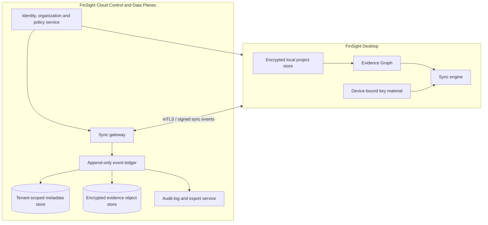

# نقشهٔ راه فنی نسخهٔ ۲ و معماری Cloud Sync

## تصمیم معماری اصلی

نسخهٔ ۲ نباید «کپی فایل‌ها به cloud» باشد. باید یک **سیستم شواهد local-first با همگام‌سازی رمزنگاری‌شده و سیاست‌محور** باشد. نسخهٔ دسکتاپ منبع اصلی کاربر برای ingest، review و مشاهده باقی می‌ماند؛ cloud یک control plane، مسیر همکاری، backup و data plane کنترل‌شده است.

این جهت با zero trust سازگار است: NIST تأکید می‌کند نباید صرفاً بر اساس location شبکه یا مالکیت asset به کاربر/دستگاه اعتماد ضمنی داد و authentication/authorization باید پیش از دسترسی به resource انجام شود. [1] در FinSight، هر سازمان، workspace، evidence object، device، token و درخواست sync باید جداگانه authorize شود.

## گزینه‌های قابل‌انتخاب برای Cloud Sync

| رویکرد | تجربهٔ کاربر | trade-off | هزینهٔ عملیاتی | پیچیدگی راه‌اندازی | مناسب برای |
|---|---|---|---|---|---|
| **Local-first بدون Cloud Sync** | فایل و Evidence Graph روی دستگاه/شبکهٔ مشتری می‌ماند؛ اشتراک‌گذاری با export رمزنگاری‌شده | کمترین ریسک داده و سریع‌ترین عرضه، اما همکاری هم‌زمان و backup مرکزی ندارد | کم | کم | pilotهای بسیار حساس، jurisdictionهای نامشخص، و اثبات workflow |
| **Cloud Sync چندمستاجری مدیریت‌شده** | دستگاه‌ها و reviewerها، پروژه‌های رمزنگاری‌شده را با کنترل سازمانی sync می‌کنند | بهترین مسیر برای scale؛ نیازمند tenancy، observability، key management و security program بالغ | متغیر و وابسته به استفاده | متوسط | نخستین ۵۰ firm پس از گذر از pilot امنیتی |
| **محیط اختصاصی یا ناحیه‌ای برای هر firm** | firm بزرگ محیط، region و سیاست‌های اختصاصی دارد | قوی‌ترین گزینه برای residency و procurement، اما onboarding و پشتیبانی پرهزینه‌تر و کندتر است | زیاد | زیاد | enterpriseهای دارای الزام داده/امنیت ویژه |

این سه گزینه باید به‌صورت رسمی در بستهٔ فروش ارائه شوند. انتخاب نباید پیش از روشن شدن jurisdiction، data-residency، نیاز SSO، حجم evidence و acceptance مدل AI انجام شود. گزینهٔ local-first، راه سبک و کم‌ریسک برای شروع است؛ گزینهٔ چندمستاجری مسیر رشد عمومی است؛ و محیط اختصاصی برای مشتریانی است که واقعاً چنین محدودیتی دارند.

## معماری هدف



### اصول داده

| اصل | اجرای فنی |
|---|---|
| Local-first | پروژهٔ قابل‌استفاده و reviewable باید هنگام قطع اینترنت نیز باز شود. |
| Immutable evidence | فایل منبع و نسخه‌های آن append-only هستند؛ اصلاح، revision جدید می‌سازد. |
| Encryption | رمزنگاری در transit، در rest و envelope encryption per tenant؛ کلیدهای حساس جدا از data store نگهداری شوند. |
| Least privilege | roleهای organization، workspace، engagement و evidence-object از هم جدا هستند. |
| Explicit AI consent | ارسال content به مدل ابری یک policy قابل‌مشاهده و قابل‌لغو می‌خواهد. |
| Data minimization | sync فقط artifactهای ضروری را منتقل می‌کند؛ telemetry خام سند یا PII را شامل نمی‌شود. |
| Audit replay | هر تغییر دارای actor، device، timestamp، causal parent، policy decision و hash است. |

## مدل Sync

### Event model

هر mutation به یک event امضاشده تبدیل شود. event شامل `event_id`، `organization_id`، `workspace_id`، `actor_id`، `device_id`، `causal_parent_ids`، `schema_version`، `payload_ciphertext` و `content_hash` است. سرور idempotency key را enforce و ترتیب causal را نگهداری می‌کند؛ کلاینت می‌تواند بعد از offline شدن، events را دوباره ارسال کند.

### Conflict policy

| نوع داده | راهبرد conflict |
|---|---|
| فایل منبع / evidence | overwrite ممنوع؛ revision یا sibling evidence ایجاد می‌شود. |
| fact extraction | هر extraction یک version مستقل دارد؛ reviewer انتخاب/رد را ثبت می‌کند. |
| mapping decision | conflict به `needs_review` برمی‌گردد، نه last-write-wins. |
| comment / task | append-only event با resolution state. |
| user preference | last-write-wins با device/timestamp قابل‌مشاهده. |
| approval / sign-off | immutable؛ revocation یک event جدید با دلیل است. |

### AI data boundary

دو حالت باید صریحاً در محصول وجود داشته باشد:

1. **Local/private mode:** evidence از دستگاه خارج نمی‌شود؛ فقط rule engine و قابلیت‌های محلی فعال هستند.
2. **Controlled cloud AI mode:** فقط snippet یا artifact موردنیاز، طبق policy سازمان و با ثبت model/provider/version/data-use policy برای یک task مشخص ارسال می‌شود.

منبع خامِ مشتری نباید به‌طور پیش‌فرض برای آموزش مشترک یا بهبود مدل استفاده شود. feedback learning باید با opt-in، anonymization و evaluation dataset نسخه‌بندی‌شده پیش برود.

## Technical Roadmap

### نسخهٔ ۲.۰ — Tax Audit Evidence Foundation

| جریان | قابلیت‌ها | دروازهٔ خروج |
|---|---|---|
| Evidence data model | document manifest، pages/tables، attachments، canonical claims، fact lineage، reviewer actions | هر claim exportable به source location بازمی‌گردد. |
| Tax-audit ontology | یک jurisdiction pack، یک type گزارش پرتکرار، date-effective rules | policy version در هر result ثبت می‌شود. |
| Rule engine | reconciliation، completeness، conflict و materiality controls | کنترل‌های سخت بدون GenAI pass می‌شوند. |
| Evaluation harness | gold set، regression suite، reviewer correction capture | هیچ feature AI بدون test sliceهای سند/زبان منتشر نمی‌شود. |
| Workpaper MVP | Decision Proof draft، unresolved queue، approval states | blocking item بدون sign-off export نمی‌شود. |

### نسخهٔ ۲.۱ — Collaboration و Cloud Sync Pilot

| جریان | قابلیت‌ها | دروازهٔ خروج |
|---|---|---|
| Identity | organization، workspace، role، MFA/SSO-ready identity model | access review و revocation قابل‌آزمون باشند. |
| Sync engine | outbox، signed event، retry/idempotency، offline queue، conflict UI | sync قطع/وصل بدون از دست‌رفتن evidence و بدون overwrite آزمایش شود. |
| Cloud data plane | tenant-scoped metadata، encrypted object store، backup/restore test | tenant isolation و restore drill موفق باشد. |
| Audit observability | immutable audit events، export، admin review | هر تغییر مهم در audit replay دیده شود. |
| Pilot controls | ۳ تا ۵ firm، data-processing agreement، incident runbook | adoption و security acceptance قبل از scale تأیید شوند. |

### نسخهٔ ۲.۲ — Enterprise Readiness

| جریان | قابلیت‌ها | دروازهٔ خروج |
|---|---|---|
| Organization control | SSO، SCIM، granular role، retention hold، legal export | security questionnaireهای مشتری هدف با شواهد پاسخ داده شود. |
| Data governance | region option، retention/deletion policy engine، key rotation | deletion و retention روی backup و active data قابل‌اثبات باشد. |
| AI governance | provider routing، model registry، prompt/retrieval logging، evaluation gate | مدل تغییر نمی‌کند مگر regression suite pass شود. |
| Compliance readiness | control inventory، vendor/subprocessor register، incident simulation | مسیر SOC 2/ISO 27001 از control واقعی، نه check-list صرف، پشتیبانی کند. |

### نسخهٔ ۲.۳ — Scale و Ecosystem

| جریان | قابلیت‌ها | دروازهٔ خروج |
|---|---|---|
| Jurisdiction packs | چند rule pack، citation corpus و localization | هر pack owner، effective date و evaluation set دارد. |
| Integrations | exportهای accounting/ERP، secure client portal یا DMS به‌صورت adapter | هیچ integration evidence lineage را نمی‌شکند. |
| Collaboration intelligence | assignment routing، materiality queue، reviewer workload | پیشنهاد routing بدون تغییر judgment یا approval policy انجام می‌شود. |
| Enterprise deployment | مسیر محیط اختصاصی/ناحیه‌ای برای مشتری واجدشرایط | قرارداد، security و support model از ابتدا repeatable هستند. |

## اجزای پیشنهادی برای بازطراحی کد

```text
core/
  evidence/          # immutable objects, facts, revisions, provenance
  tax_ontology/      # canonical concepts and jurisdiction packs
  rules/             # deterministic controls and materiality policies
  proofs/            # Decision Proof composition and sign-off states
  evaluation/        # gold sets, regression, calibration, review feedback
sync/
  outbox/            # durable local event queue
  protocol/          # event schema, signatures, causal ordering, idempotency
  conflicts/         # domain-specific resolution workflow
cloud/
  identity/          # organizations, roles, device trust, session policy
  workspaces/        # tenant-scoped project metadata
  objects/           # encrypted evidence/object storage
  audit/             # append-only event ledger and export
  ai_gateway/        # policy-bound provider routing and AI request log
```

## Security gates before Cloud Sync sales

1. Threat model برای دستگاه گم‌شده، credential theft، cross-tenant access، malicious insider، provider compromise و sync replay.
2. Pen-test و dependency/secret scanning به‌عنوان release gate.
3. Tenant-isolation tests در database، object store، cache، queue و log aggregation.
4. Backup/restore و deletion/retention drill با evidence قابل‌ارائه به مشتری.
5. Incident classification، owner، notification workflow و tabletop exercise.
6. Security trust pack به‌روز: architecture، encryption، data flow، AI policy، subprocessors و evidence of controls.

NIST AI RMF بر مدیریت trustworthiness در طراحی، استفاده و ارزیابی تأکید دارد؛ NIST Zero Trust نیز بر تصمیم‌های صریح authentication/authorization برای resourceها. [1] [2] این دو چارچوب باید به backlog کنترل‌های واقعی تبدیل شوند، نه اسلاید فروش.

## منابع

[1]: https://www.nist.gov/itl/ai-risk-management-framework "NIST — AI Risk Management Framework"
[2]: https://www.nist.gov/publications/zero-trust-architecture "NIST — Zero Trust Architecture"
